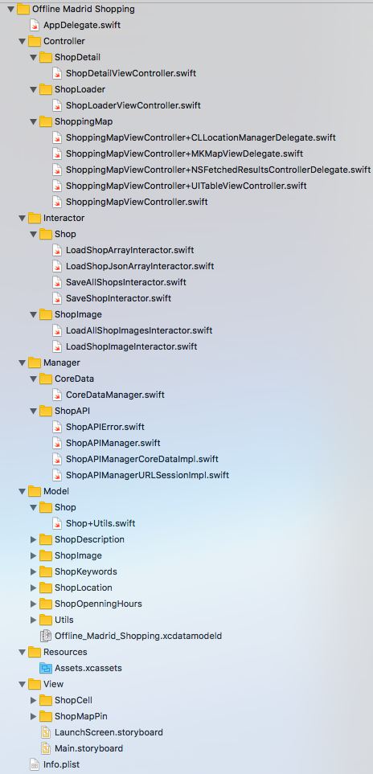

# Offline Madrid Shopping (another iOS app) #

Project for Advanced iOS module of the 4th [KeepCoding Mobile Startup Engineering Bootcamp](https://keepcoding.io/en/keepcodingstartupengineeringmasterbootcamp/ "KeepCoding Mobile Startup Engineering Bootcamp")

### Project summary ###

* Name: Offline Madrid Shopping
* Description: iOS app to locate the most important shops in Madrid. It works offline (all data is in local storage)
* Version: 1.0
* Language: Swift 3.0

### How do I get set up? ###

* Clone repository: git clone git@github.com:jaisato/kc-boot4-offline-madrid-shopping.git
* Configuration: open .xcodeproj file with XCode. Build project and run it. 
* Dependencies: none
* Database configuration: internal storage with CoreData (SQLLite)

### Project structure ###

This project is structured following a clean architecture style. 
Its folder structure is as follows:

* AppDelegate: bootstrap or entry point of application
* Controller: all view controllers are here
    * ShopDetail: controller of shop details
    * ShopLoader: start controller of application (downloads and loads shop data)
    * ShoppingMap: main controller of app. List of shops and shopping map (splitted in files by implemented protocols).
* Interactor: all interactor are here
    * Shop: shop interactors
        * LoadShopArrayInteractor: load all shops from array
        * LoadShopJsonArrayInteractor: load all shops from json object.
        * SaveAllShopsInteractor: save all shops
        * SaveShopInteractor: save a shop
    * ShopImage: shop image interactors
        * LoadAllShopImagesInteractor: load all shop images
        * LoadShopImageInteractor: loas a shop image
* Manager: all manager are here (CoreData and ShopAPI)
    * CoreData: manager of CoreData
    * ShopAPI: managers of the Shop API
        * ShopAPIError: enum of API errors
        * ShopAPIManager: protocol (interface) of Shop API
        * ShopAPIManagerCoreDataImpl: CoreData implementation of Shop API protocol
        * ShopAPIManagerURLSessionImpl: URLSession implementation of Shop API protocol
* Model: all model classes are here (Shop, ShopImage, ShopLocation, etc)
    * Shop: Shop model
    * ShopDescription: Shop description model
    * ShopImage: Shop image model
    * ShopKeywords: Shop keywords model
    * ShopLocation: Shop location model
    * ShopOpeningHour: Shop openning hours model
    * Utils: Utils classes (Language and Locale)
    * Offline\_Madrid\_Shopping.xcdatamodeld: CoreData data model
* Resources: all resoruces are here (assets, images, etc)
    * Assets: app assets
* View: views are here (storyboards, xib, cells, etc)
    * ShopCell: shop cell view
    * ShopMapPin: Shop map pin view model
    * LaunScreen.storyboard: app launch storyboard
    * Main.storyboard: app main storyboard
* Info.plist: information property list file with config info for app bundle.

### Who do I talk to? ###

* Project owner: Jairo S.T.
* Email: jairosarabia@gmail.com
* Bitbucket: https://bitbucket.org/jasato/
